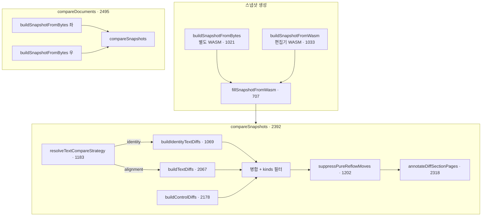
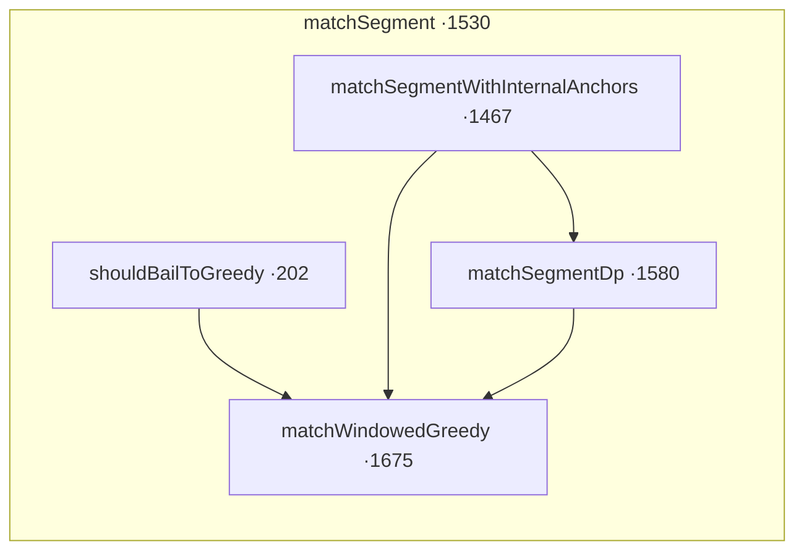

# diff-engine.ts 구조 설명

이 문서는 `diff-engine.ts`의 **현재 구현**을 기준으로, **이력 관리(동일 세션·stable_id)** 와 **문서 비교(외부 파일·다른 혈통)** 경로를 나누어 설명합니다.

**줄 번호**는 모두 `rhwp/rhwp-studio/src/compare/diff-engine.ts` 기준(함수 **선언이 시작되는 줄**). 편집 후에는 `rg "^function |^export "` 등으로 다시 맞추면 됩니다.

---

## 목차

0. [함수·라인 색인](#0-함수라인-색인)
1. [한눈에 보기](#1-한눈에-보기)
2. [이력 관리 경로](#2-이력-관리-경로)
3. [문서 비교(alignment) 경로](#3-문서-비교alignment-경로)
4. [양 경로가 공유하는 부분](#4-양-경로가-공유하는-부분)
5. [튜닝 상수와 의존 관계](#5-튜닝-상수와-의존-관계)
6. [UI에서의 호출](#6-ui에서의-호출)
7. [디버그 로그 ①②③](#7-디버그-로그-①②③)
8. [문서 유지보수 시 구상](#8-문서-유지보수-시-구상)
9. [왜 이 로직이 추가됐는가](#9-왜-이-로직이-추가됐는가-문제--대응)

---

## 0. 함수·라인 색인

### 0.1 공개 API

| 함수 | 줄 |
|------|-----:|
| `buildSnapshotFromBytes` | 1021 |
| `buildSnapshotFromWasm` | 1033 |
| `compareSnapshots` | 2392 |
| `compareDocuments` | 2495 |

### 0.2 스냅샷·문단·컨트롤 수집

| 함수 | 줄 |
|------|-----:|
| `fillSnapshotFromWasm` | 707 |
| `compactParaShapeForAnchor` | 688 |
| `resolveAnchorTuning` | 156 |
| `resolvePerformanceTuning` | 166 |
| `shannonEntropy` | 173 |
| `isAnchorTextQualityOk` | 190 |
| `normalizeText` | 385 |
| `simpleHash` | 391 |
| `simpleHashBytes` | 401 |
| `buildTableSummary` | 474 |
| `mapControlKind` | 423 |
| `canonicalControlKey` | 435 |
| `controlSnapshotQuality` | 448 |

### 0.3 컨트롤 diff 세부

| 함수 | 줄 |
|------|-----:|
| `buildGranularControlDiffs` | 609 |
| `extractControlIndexFromKey` | 560 |
| `parseSummaryKV` | 567 |
| `countChangedCellsByHash` | 580 |

### 0.4 이력(identity)·전략·후처리

| 함수 | 줄 |
|------|-----:|
| `buildStableIdMap` | 1046 |
| `buildIdentityTextDiffs` | 1069 |
| `resolveTextCompareStrategy` | 1183 |
| `isParagraphMoveMeta` | 1194 |
| `suppressPureReflowMoves` | 1202 |
| `preferRightPath` | 1276 |

### 0.5 alignment — 앵커·정렬

| 함수 | 줄 |
|------|-----:|
| `buildUniqueSigPairsInSlices` | 1290 |
| `buildAnchorPairs` | 1329 |
| `charBigramSimilarity` | 1363 |
| `textSimilarity` | 1377 |
| `isNearStructure` | 1413 |
| `isNearStructureLongPair` | 1423 |
| `softSimilarityThresholdForPair` | 1433 |
| `getEffectiveSimilarity` | 1441 |
| `matchCost` | 1452 |
| `matchSegmentWithInternalAnchors` | 1467 |
| `matchSegment` | 1530 |
| `matchSegmentDp` | 1580 |
| `scorePairGreedy` | 1659 |
| `matchWindowedGreedy` | 1675 |

### 0.6 alignment — `buildTextDiffs` 보정 헬퍼

| 함수 | 줄 |
|------|-----:|
| `isLeftParagraphSplitIntoTwoRightParas` | 1745 |
| `shouldPromoteEmptyTextEdit` | 1767 |
| `shouldMergeRemovedAddedAsModify` | 1830 |
| `buildTextDiffs` | 2067 |

### 0.7 컨트롤 diff 병합·쪽번호·유틸

| 함수 | 줄 |
|------|-----:|
| `kindLabel` | 461 |
| `mkDiffId` | 411 |
| `extractTablePatiencePins` | 2114 |
| `buildControlDiffs` | 2178 |
| `pairControlsFallback` | 2252 |
| `scoreControlFallback` | 2283 |
| `annotateDiffSectionPages` | 2318 |
| `myersCharDiffSummary` | 364 |

### 0.8 성능 가드·타입·기본 옵션

| 항목 | 줄 |
|------|-----:|
| `CompareRuntimeGuard` 타입 | 148 |
| `activeRuntimeGuard` | 153 |
| `shouldBailToGreedy` | 202 |
| `AlignedPair` 타입 | 1264 |
| `ControlPair` 타입 | 1270 |
| `DEFAULT_COMPARE_OPTIONS` | 2163 |
| `activeCompareOptions` | 2170 |
| 튜닝 `const` 블록 시작 | 95 |
| 문자 diff 상한 `CHAR_DIFF_*` | 130–135 |

---

## 1. 한눈에 보기

### 1.1 파일이 하는 일

- WASM/IR에서 **`CompareDocumentSnapshot`**(문단·컨트롤·메타)을 채우고,
- 좌·우 스냅샷을 **`CompareSession`**(`diffItems` 등)으로 줄입니다.
- **본문 텍스트** 비교는 `options.strategy`와 **stable_id 맵 구성 가능 여부**에 따라
  - **`identity`**: `stable_id`로 1:1 매칭 (이력에 유리) — `buildIdentityTextDiffs` (**1069**)
  - **`alignment`**: 앵커 + 구간 DP/그리디 — `buildTextDiffs` (**2067**)

### 1.2 전체 플로우 (요약 다이어그램)



---

## 2. 이력 관리 경로

“이력”은 **같은 편집 세션·같은 WASM 인스턴스 혈통**에서 `stable_id`가 문단 정체성으로 유지된다는 전제에 가장 잘 맞습니다.

### 2.1 스냅샷: `buildSnapshotFromWasm` (**1033**)

편집기에 올라온 문서를 **현재 `WasmBridge` 그대로** 스냅샷합니다. 내부에서 `getDocumentInfo` 후 **`fillSnapshotFromWasm` (707)** 로 위임합니다.

### 2.2 공통 채움: `fillSnapshotFromWasm` (**707**)

문단마다 `text`, `normalizedText`, `signature`(정규화 텍스트·컨트롤 개수·`getParaPropertiesAt` 기반 문단모양 digest), `stableId`, `globalIndex`, `anchor`, `isAnchorCandidate` 등을 채웁니다. 앵커 후보 판별에는 **`resolveAnchorTuning` (156)**, **`isAnchorTextQualityOk` (190)** 가 쓰입니다. 컨트롤은 레이아웃·문단 순회로 수집 후 **`canonicalControlKey` (435)** / **`controlSnapshotQuality` (448)** 로 중복 제거·품질 선택합니다.

### 2.3 비교 진입: `compareSnapshots` (**2392**) + 전략

이미 만든 스냅샷 두 개를 비교합니다. 전략 결정은 **`resolveTextCompareStrategy` (1183)** : `strategy === 'identity'` 이고 양쪽 **`buildStableIdMap` (1046)** 가 성공할 때만 identity, 아니면 alignment 폴백.

본문 diff 분기는 **`compareSnapshots` (2446–2450)** 근처: `textMode === 'identity'` 이면 `buildIdentityTextDiffs`, 아니면 `buildTextDiffs`.

### 2.4 Identity 본문: `buildStableIdMap` (**1046**) + `buildIdentityTextDiffs` (**1069**)

- `stableId`가 비어 있는 문단이 있으면 맵이 `null` → identity 불가.
- 중복 `stableId`는 등장 순서로 `#` 접미 키 정규화 (**1046** 주석과 구현 참고).

`buildIdentityTextDiffs`에서 합집합 키 순회로 removed / added / modified(`myersCharDiffSummary` **364**) / paragraphMeta(이동·컨트롤 수)를 생성합니다.

### 2.4.1 이력(Identity) 알고리즘 상세

아래 순서는 `buildIdentityTextDiffs`에서 실제로 diff를 만드는 핵심 절차입니다.

1. **양쪽 stable_id 맵 구성** — `buildStableIdMap` (**1046**)  
   - 실패 조건: 문단 하나라도 `stableId` 없음 → `null` 반환  
   - 보정: 중복 id는 `#occurrence`를 붙여 키 충돌 방지
2. **키 합집합 생성 + 정렬** — `buildIdentityTextDiffs` (**1069**)  
   - `keys = set(leftKeys ∪ rightKeys)`  
   - 정렬 기준: `(section, paragraph)` 우선 (좌/우 중 존재하는 좌표 사용)
3. **키 단위 분기**  
   - `l && !r` → `removed`  
   - `!l && r` → `added`  
   - `l && r` → 텍스트/메타 비교 단계로 진입
4. **텍스트 변경 판정**  
   - `l.normalizedText !== r.normalizedText`면 `modified`  
   - 사용자용 요약은 `myersCharDiffSummary` (**364**, Hirschberg·`CHAR_DIFF_*` 상한)로 별도 생성
5. **문단 메타 변경 판정 (`paragraphMeta` 포함 시)**  
   - 이동: `l.signature === r.signature` && `|l.globalIndex-r.globalIndex| > MOVE_DISTANCE_THRESHOLD(3)`  
   - 개체 수: `l.controlCount !== r.controlCount`

핵심 포인트: identity 경로는 **문단 짝짓기 자체를 sid로 확정**하고, 그 후 “무엇이 바뀌었는가”만 계산합니다. 그래서 alignment보다 짝짓기 불확실성이 낮고, 계산량도 키 수에 비례하는 형태입니다.

### 2.5 이동 노이즈 제거: `suppressPureReflowMoves` (**1202**)

보조로 **`isParagraphMoveMeta` (1194)**. 삽입·삭제로 인덱스만 밀린 경우와 순서 변경을 구분합니다.

### 2.5.1 `suppressPureReflowMoves` 판정 규칙 요약

`moved`를 모두 제거하지 않고, “진짜 이동”만 남기기 위해 다음을 검사합니다.

1. **공유 sid 상대순서 보존 검사**  
   - `rankLeft[sid] === rankRight[sid]` 이면 상대순서는 유지된 상태
2. **밀림량 설명 가능성 검사**  
   - `delta > 0`(오른쪽에서 뒤로 밀림): 오른쪽 prefix의 “오른쪽 전용 문단 개수”와 `delta` 일치 시 reflow로 간주  
   - `delta < 0`(앞으로 당겨짐): 왼쪽 prefix의 “왼쪽 전용 문단 개수”와 `-delta` 일치 시 reflow로 간주
3. 위 두 조건을 만족하면 `moved` 제거, 아니면 유지

즉, 이 함수는 “순서 변경” 이벤트를 **삽입/삭제에 의한 위치 재배치**와 분리하는 후처리 필터입니다.

### 2.6 이력 경로 플로우 (정리)

```mermaid
sequenceDiagram
  participant UI as history-dialog
  participant WASM as WasmBridge
  participant Snap as buildSnapshotFromWasm ·1033
  participant Cmp as compareSnapshots ·2392
  participant Id as buildIdentityTextDiffs ·1069

  UI->>WASM: 편집 문서
  UI->>Snap: 시점 A 스냅샷
  UI->>Snap: 시점 B 스냅샷
  UI->>Cmp: strategy identity (권장)
  Cmp->>Cmp: resolveTextCompareStrategy ·1183
  alt maps OK
    Cmp->>Id: 텍스트 diff O(N) 키 순회
  else 폴백
    Cmp->>buildTextDiffs: alignment ·2067
  end
  Cmp->>buildControlDiffs: 표/도형 등 ·2178
  Cmp->>suppressPureReflowMoves ·1202
```

---

## 3. 문서 비교(alignment) 경로

서로 다른 파일을 각각 **새 WASM**으로 열면 `stable_id` 세션이 달라 공유 sid가 거의 없습니다. 이 경우 **문단 정렬(alignment)** 이 본문 비교의 중심입니다.

### 3.1 진입: `compareDocuments` (**2495**)

좌·우 **`buildSnapshotFromBytes` (1021)** 후 **`compareSnapshots` (2392)**.

호출부에서 `strategy: 'alignment'`(또는 기본)이면 **`resolveTextCompareStrategy` (1183)** 가 alignment를 고릅니다.

### 3.2 단계 A — 글로벌 앵커: `buildAnchorPairs` (**1329**)

`isAnchorCandidate` 및 시그니처 유일성, `ri` 단조 조건으로 앵커 쌍을 만듭니다.

### 3.3 단계 B — 구간 정렬: `matchSegment` 계열

| 함수 | 줄 | 역할 요약 |
|------|-----:|-----------|
| `matchSegment` | 1530 | 구간 진입·DP/그리디/내부앵커 분기 |
| `matchSegmentWithInternalAnchors` | 1467 | 유일 시그니처로 쪼개 재귀 |
| `matchSegmentDp` | 1580 | 2차원 DP, `matchCost` 치환 |
| `matchWindowedGreedy` | 1675 | 윈도 그리디, `scorePairGreedy` |
| `shouldBailToGreedy` | 202 | 타임버짓 시 조기 그리디 |



유사도·비용 체인: **`textSimilarity` (1377)** → **`getEffectiveSimilarity` (1441)** → **`matchCost` (1452)**; 구조 플래그는 **`isNearStructure` (1413)**, **`isNearStructureLongPair` (1423)**, **`softSimilarityThresholdForPair` (1433)**. 그리디 점수는 **`scorePairGreedy` (1659)**.

### 3.3.1 alignment 정렬 알고리즘 상세

`buildTextDiffs`(**2067**)는 먼저 앵커로 구간을 나누고, 각 구간에 아래 정렬기를 적용합니다.

1. **구간 선택기** — `matchSegment` (**1530**)  
   - base case: 좌/우 길이 0이면 남은 쪽을 added/removed 페어로 반환  
   - 성능 가드: `shouldBailToGreedy` (**202**) true면 즉시 그리디  
   - 셀 수 조건: `n*m`이 임계 이상이면 내부 앵커 분할 또는 그리디
2. **내부 앵커 분할** — `matchSegmentWithInternalAnchors` (**1467**)  
   - `buildUniqueSigPairsInSlices` (**1290**)로 구간 내 “유일 시그니처” 페어를 찾고  
   - 경계 사이를 재귀적으로 다시 `matchSegment` 처리
3. **DP 정렬** — `matchSegmentDp` (**1580**)  
   - 점화식: `dp[i][j] = min(match, del, ins)`  
   - 삭제/삽입 비용은 고정(1.05), 치환은 `matchCost` (**1452**)  
   - 백트래킹 우선순위: `match > delete > insert` (동률 시 시각적 밀림 완화)
4. **그리디 정렬** — `matchWindowedGreedy` (**1675**)  
   - 오른쪽 문단 순회하며 왼쪽 후보를 윈도에서 검색  
   - 점수: `scorePairGreedy` (**1659**)  
   - `minScore(3.45)` 미달/동률(ambiguous)면 unmatched 처리  
   - 단, 1위가 `isNearStructure`면 ambiguous 검사 생략

핵심 포인트: alignment는 “완전 매칭”이 아니라 **구조 제약 + 비용 최소화**로 가장 그럴듯한 1:1 정렬을 만든 뒤, 이후 단계에서 라벨을 보정하는 2단계 구조입니다.

### 3.4 단계 C — 정렬 스트림 → Diff: `buildTextDiffs` (**2067**)

1. **`buildAnchorPairs` (1329)** 로 경계·앵커 쌍 반영 후 구간마다 **`matchSegment` (1530)**.
2. 순차 스캔에서 **`shouldPromoteEmptyTextEdit` (1767)**, **`shouldMergeRemovedAddedAsModify` (1830)**, **`isLeftParagraphSplitIntoTwoRightParas` (1745)** 등으로 라벨 보정.
3. 일반 `(L,R)`는 텍스트·이동·컨트롤 수 메타 (**`cleanupParagraphAlignStepsToDiffItems` 1865–2065** 메인 루프).

### 3.4.1 `buildTextDiffs` 라벨 보정 규칙(우선순위)

정렬 결과 `aligned[]`를 앞에서부터 읽을 때, 아래 규칙을 **위에서 아래 순서로** 적용합니다.

1. **빈 문단 편집 승격** — `shouldPromoteEmptyTextEdit` (**1767**)  
   - `(L,null)(null,R)` 또는 반대 패턴에서 구조 신호가 맞으면 “삭제+추가” 대신 1건의 `modified`
2. **삭제+추가 병합 승격** — `shouldMergeRemovedAddedAsModify` (**1830**)  
   - 같은 섹션/유사 거리/유사도 조건 만족 시 `modified-merged`
3. **문단 쪼개기 라벨 교정** — `isLeftParagraphSplitIntoTwoRightParas` (**1745**)  
   - `(null,R앞)(L,R뒤)` 패턴이면 `R앞=modified`, `R뒤=added`로 재배열
4. **기본 라벨 처리**  
   - 단일 `(null,R)` → `added`, `(L,null)` → `removed`, `(L,R)` → 필요 시 `modified`
5. **메타 추가**  
   - 서명 동일 + 이동 임계 초과 시 `paragraphMeta:moved`  
   - `controlCount` 불일치 시 `paragraphMeta:ctrlcount`

핵심 포인트: 이 단계는 정렬기를 바꾸지 않고도 사용자 체감 오류(삭제+추가 오탐, 분할 라벨 역전)를 줄이기 위한 **결과 재해석 레이어**입니다.

---

## 4. 양 경로가 공유하는 부분

| 영역 | 함수 | 줄 | 설명 |
|------|------|-----:|------|
| 스냅샷 채움 | `fillSnapshotFromWasm` | 707 | 이력·문서 비교 동일 형식; `signature`에 문단모양(ps) 포함 |
| 정규화 | `normalizeText` | 385 | 공백/대소문자 옵션 |
| 문자 요약 | `myersCharDiffSummary` | 364 | identity `inlineTextDiff`; 접두·접미·Hirschberg·`CHAR_DIFF_*` (**130–135**) |
| 컨트롤 diff | `buildControlDiffs` | 2178 | key 매칭 → `extractTablePatiencePins` → 폴백 |
| 표 patience 핀 | `extractTablePatiencePins` | 2114 | 요약 키 양쪽 유일 1:1 표만 선매칭 |
| 폴백 매칭 | `pairControlsFallback` | 2252 | |
| 폴백 점수 | `scoreControlFallback` | 2283 | |
| 세분 diff | `buildGranularControlDiffs` | 609 | |
| 쪽번호 | `annotateDiffSectionPages` | 2318 | UI 표시 |
| 성능 가드 | `shouldBailToGreedy` | 202 | `activeRuntimeGuard` **153** |
| 이동 필터 | `suppressPureReflowMoves` | 1202 | 최종 단계 공통 |

`compareSnapshots` 후반 처리 순서(같은 파일 **2452–2473** 근처): `buildControlDiffs` 병합 → `kinds` 필터 → `suppressPureReflowMoves` → `annotateDiffSectionPages` → 구역·문단 정렬.

---

## 5. 튜닝 상수와 의존 관계

**`const` 블록**은 파일 **95**행부터 (`WINDOW_SIZE`, `ANCHOR_*`, `SEGMENT_DP_MAX`, `MATCH_*`, `NEAR_STRUCTURE_*`, `GREEDY_*`, `REMOVED_ADDED_*`, `CHAR_DIFF_*` 등).

의존 요약:

- **`isNearStructure` (1413)** 가 true일 때 NEAR_STRUCTURE 계열이 강하게 작동.
- `globalIndex` 밀림으로 구조 근접이 깨지면 **`shouldMergeRemovedAddedAsModify` (1830)** 등이 보완층.

---

## 6. UI에서의 호출

| 파일 | import | 용도 |
|------|----------|------|
| `src/ui/history-dialog.ts` | `buildSnapshotFromWasm`, `compareSnapshots`, `compareDocuments` | 편집 문서 스냅샷 + 이력/비교 |
| `src/ui/compare-dialog.ts` | `compareDocuments` | 외부 두 파일 비교 |

---

## 7. 디버그 로그 ①②③

`isCompareDebugEnabled()`일 때 **`compareSnapshots` (2392)** 내부:

- **①** `stable_id` 품질·문단 헤더 — **2425–2442**
- **②** `textMode`, 공유 sid — **2443–2452**
- **③** alignment 시 앵커 로그 — **`buildTextDiffs` (2067)** 내 **`compareDbg` 블록 (2072–2085)**

---

## 8. 문서 유지보수 시 구상

1. **§0 색인표**: `export` / 핵심 `function` 선언 줄을 PR마다 또는 큰 편집 후 한 번 갱신.
2. **전략**: `CompareOptions.strategy` + **`resolveTextCompareStrategy` (1183)** 조건.
3. **Mermaid**: 분기나 함수 이름이 바뀌면 다이어그램 라벨만 맞춤.
4. **본문 내 줄 범위**: `compareSnapshots`·`buildTextDiffs`처럼 긴 함수는 절차만 범위로 적었으면, 진입점은 **§0**의 함수 시작 줄을 기준으로 IDE에서 이동.
5. **컨트롤 kind 확장 동기화**: `DiffKind`가 확장되면(`image` 등) `mapControlKind`, `DEFAULT_KINDS`(history/compare), UI `kindLabel`을 같이 갱신.
6. **표 텍스트 표시 계약 유지**: table 요약의 `cprev/csha/txt/props` 포맷 변경 시 `parseCellPreviewMap`/`formatCellPreviewDiff`를 같이 수정.
7. **표 카드 fallback 정책**: 셀 미리보기 한계가 있어도 “변경 셀 수” 또는 “속성 해시 전/후”를 표시해 빈 카드가 나오지 않게 유지.
8. **검증 루틴**: `npx tsc --noEmit` + UI 스모크(이력/문서 비교 둘 다) + 대표 시나리오(H-07, D-07) 재확인.

새 동작은 **이력 전용 / alignment 전용 / 공통**을 먼저 나눈 뒤 §2·§3·§4에 반영하면 읽는 흐름이 유지됩니다.

---

## 9. 왜 이 로직이 추가됐는가 (문제 → 대응)

아래는 실제 운영/디버깅에서 자주 보인 문제 패턴과, 이를 완화하기 위해 들어간 핵심 로직의 대응 관계입니다.

### 9.1 이력(identity) 경로

| 문제 상황 | 증상 | 대응 로직(함수/줄) |
|---|---|---|
| 동일 문서 이력인데도 sid 누락/중복으로 identity 실패 | 기대는 빠른 1:1인데 alignment 폴백으로 변동성 증가 | `buildStableIdMap` (1046): sid 누락 시 실패 감지, 중복 sid `#occurrence` 정규화 |
| 삽입/삭제 때문에 `moved`가 과검출 | 실제 순서 변경이 아닌데 이동 알림 다수 | `suppressPureReflowMoves` (1202): 상대순서 + prefix 삽입/삭제량으로 reflow 필터링 |
| 수정량이 큰 문단에서 “무엇이 바뀌었는지” 읽기 어려움 | modified는 뜨지만 변경 밀도 파악 어려움 | `myersCharDiffSummary` (364): 편집거리·패턴 요약(Hirschberg·`CHAR_DIFF_*`) |

### 9.2 alignment(문서 비교) 경로

| 문제 상황 | 증상 | 대응 로직(함수/줄) |
|---|---|---|
| 반복 문구/짧은 문단이 앵커로 잡혀 정렬 전체가 밀림 | 뒤 구간이 연쇄적으로 added/removed 오탐 | `isAnchorTextQualityOk` (190), `buildAnchorPairs` (1329): 길이/중복/품질 필터로 앵커 오염 억제 |
| 대구간에서 DP 비용 폭발/브라우저 정지 | 비교 시간이 급증하거나 UI 프리징 | `matchSegment` (1530), `shouldBailToGreedy` (202), `matchWindowedGreedy` (1675): 셀 수/시간 기반 fallback |
| 의역/미세 수정 문단이 서명 불일치로 매칭 탈락 | 삭제+추가로 쪼개져 사용자 체감 품질 저하 | `textSimilarity` (1377), `getEffectiveSimilarity` (1441), `matchCost` (1452), `scorePairGreedy` (1659): 구조근접 기반 비용/점수 보정 |
| 윈도 그리디에서 1·2위 점수차가 작아 둘 다 버림 | 맞는 후보가 있어도 unmatched 증가 | `matchWindowedGreedy` (1675): 1위가 `isNearStructure`면 ambiguous 검사 생략 |
| 정렬 결과가 (삭제+추가)로만 나와 수정 의도가 사라짐 | 실제는 수정인데 added/removed 2건으로 보임 | `shouldMergeRemovedAddedAsModify` (1830): 유사도/거리 조건으로 modified 병합 |
| 빈 문단 편집(빈→텍스트/반대)이 삭제+추가로 표시 | 사용자는 단순 입력/삭제인데 과한 diff | `shouldPromoteEmptyTextEdit` (1767): 구조 신호 맞으면 modified 승격 |
| 문단 분할 케이스에서 라벨 순서가 어색 | `(null,R앞)(L,R뒤)`가 추가+수정 순으로 역전 | `isLeftParagraphSplitIntoTwoRightParas` (1745): 변경+추가로 재라벨 |

### 9.3 컨트롤(표/도형/이미지/차트) 추적

| 문제 상황 | 증상 | 대응 로직(함수/줄) |
|---|---|---|
| 레이아웃/문단 번호 밀림으로 같은 개체를 다른 개체로 인식 | modified 대신 removed+added 다발 | `canonicalControlKey` (435): `sid:` 우선 stem 정규화로 동일 개체 추적 |
| 같은 키 후보가 여러 번 수집될 때 품질 불균형 | 저품질 요약이 채택돼 diff 품질 저하 | `controlSnapshotQuality` (448): 텍스트/픽셀/bbox 정보가 풍부한 스냅샷 우선 |
| key가 변한 컨트롤을 전부 신규/삭제로 처리 | 작은 위치 변화에도 추적 단절 | `extractTablePatiencePins` (2114) 후 `pairControlsFallback` (2252), `scoreControlFallback` (2283): 표 유일 키 선매칭 + 타입/요약/위치 근접 |
| 표 내부 변경이 “표 변경” 한 줄로만 보임 | 어떤 셀이 바뀌었는지 불명확 | `buildTableSummary` (474), `buildGranularControlDiffs` (609), `countChangedCellsByHash` (580): 셀 요약/해시 기반 세분화 |
| 이미지가 도형으로 묶여 표시됨 | 결과 카드 의미가 모호 | `DiffKind`에 `image` 추가 + `mapControlKind`/UI `kindLabel` 동기화 |
| 표 텍스트 카드가 인코딩/빈값처럼 보임 | 행/열별 값 확인 어려움 | `cprev` 포맷 고정 + UI `parseCellPreviewMap`(`&amp;` 정규화/URL decode) + 구조변경 union-key 렌더 |
| 표 속성 변경 카드의 근거 부족 | “속성 값 변경”만 보임 | 값 행이 없을 때 `props` 전/후 fallback 표시 |

### 9.4 운영 관점 공통 대응

| 문제 상황 | 증상 | 대응 로직(함수/줄) |
|---|---|---|
| kinds가 많아 결과 노이즈 증가 | 사용자가 핵심 변경을 놓침 | `compareSnapshots` (2392): `options.kinds` 필터 후 최종 반환 |
| 메타 diff에서 쪽번호 탐색 불편 | 좌/우 페이지 점프 어려움 | `annotateDiffSectionPages` (2318): 문단/anchor 기반 sectionPage 주석 |

---

*기준: `diff-engine.ts` — 본 README의 줄 번호는 편집 시 어긋날 수 있으니 §0을 소스와 함께 갱신할 것.*
